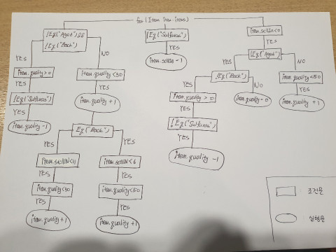

# 실전코딩 2조 Refactoring 과제 

## 조원
이안규, 원동욱, 최진영, 최지원, 김도연 

총 5명

## DirtySample 분석

### 변수의 의미
- name: 상품의 이름
- quality: 상품의 가치
- sellIn: 남은 유통 기한

### 아이템 분석
- Sulfuras를 제외한 모든 상품의 quality의 최대는 50(최고가치)이다.
- Sulfuras를 제외한 모든 상품은 updateQuality method가 한 번 실행될때마다 sellIn이 1 감소한다.

Aged Brie(치즈)
- sellIn이 0초과이면 quality가 1 증가한다.
- sellIn이 0이하이면 quality가 2 증가한다.
(치즈는 시간이 지날수록 숙성이 된다는 의미)
- quality는 50을 초과할 수 없다.

Backstage passes to a TAFKAL80ETC(콘서트 티켓)
- 공연이 가까워 질 수록 quality는 올라간다. 
- sellIn이 0일이하이면 quality가 0이 된다
- sellIn이 1일이상 6일미만이면 quality가 3 증가한다.
- sellIn이 6일이상 11일미만이면 quality가 2 증가한다.
- sellIn이 11일이상이면 quality가 1 증가한다.
(quality 최대50, 최소0)

Sulfuras, Hand of Ragnaros(게임 속 전설의 아이템)
- 아무 변화가 없다.
(게임 아이템이기 때문에 sellIn과, quality가 변하지 않는다.)

그 외(일반상품)
- quality가 50보다 작으면 quality는 1씩 감소한다.
- sellIn이 0보다 같거나 작고, quality가 0보다 크면 quality는 1씩 감소한다.

## Test 코드 예시
```java

@Test
    public void Aged_Brie의_SellIn이_0이상이면_퀄리티가_플러스1 () {
        testList = new Item[1];
        Item item1 = new Item("Aged Brie",2,49);
        testList[0] = item1;
        int testQuality = item1.quality + 1;

        DirtySample dirtySample = new DirtySample(testList);
        dirtySample.updateQuality();

        assertThat(dirtySample.items[0].quality, is(testQuality));
    }
```

## Refactoring 과정
0. Dirty code의 동작 과정을 그림을 그려 파악



1. Dirty code 분석을 통한 Test 함수 결정
2. Test Code 작성 및 Test Case 생성
3. Refactoring
- 조건 나누는 기준 정하기(item 속성 관련 조건 : 6개, 이름 관련 조건: 7개)
- 이름 조건이 가장 많아서 이름으로 나누기
- 이름 검사하는 조건 함수로 만들기
- 각 이름에 부합하는 경우(총 4가지)에 대한 실행조건 정리하고 코드 작성
- item.quality < 50 함수로 만들기
- 피드백

4. Test Code로 검증


## 실행 코드 예시
```java
//Item.java

@AllArgsConstructor
public class Item {

    public String name;
    public int expirePeriod;
    public int quality;


    @Override
    public String toString() {
        return this.name + ", " + this.expirePeriod + ", " + this.quality;
    }
}

```

```java
//DirtySample.java

private void updateAgedQuality(Item item) {
        item.sellIn -= 1;
        if(isQualityLessthan50(item)){
            item.quality += 1;
            if(item.sellIn <= 0 && isQualityLessthan50(item)) item.quality += 1;
        }
    }

```

